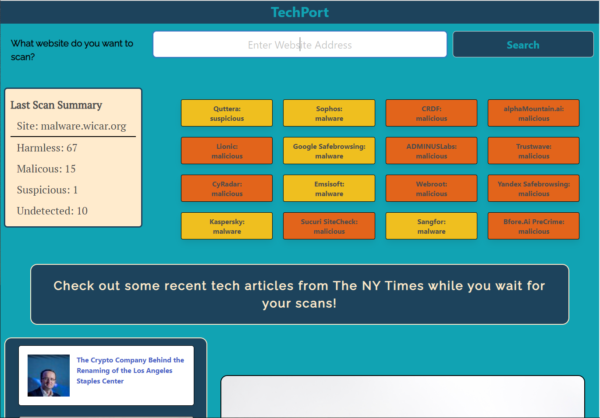

# Web_Security
---

  
  
   
   
   
   
## Description

As beginning web developers we find ourself using the internet to help us solve all sorts of issues related to creating the perfect (we hope) websites. Keeping up on the latest technology news and being able to scan a website we have never heard of that shows up on our searches for help, both seem very valuable to us.

---
  ## Table of Contents

  [Features](#features)

  [Screenshot](#screenshot)

  [Installation](#installation)
    
  [Usage](#usage)
    
  [Credits](#credits)
    
  [License](#license)
    
  [Contributing](#contributing)

  [Questions](#questions)
  
  

---

## Features

      1. Working with an array of Objects. 

      2. Creating a dynamic list of articles. 

      3. Bulma cards which are dynamically created. 

      4. Working with complicated logic. 

      5. Dynamically creating web elements. 

      6. Responsive design. 

      7. Using the New York Times API to get specifically Technology articles. 

      8. Using the VirusTotal API to scan any website URL for malware. 
---

## Screenshot 
  
  
  

  ---

  ## Installation

      1. Clone repository to your computer. 

      2. Install the live server extension. 
---
  ## Usage

      1. Open the index.htm file with the live server extension. 
---
  ## Credits

      1. Thank you to NY Times and VirusTotal for their fine APIs. 

  ---
  ## License 

  &emsp; 

      To read about the license of this project click the link below.

  &emsp;[License](https://github.com/tgtiburon/Web_Security/blob/main/LICENSE) 

  ---
  ## Contributing

      1. Email me or contact us using the issues tab on github. 

## Made by: 
              Bryant Torres, Tony Gendreau, Dylan Bittikofer, and Leon Lemeshko.

---
## Questions

If you have any questions about this project feel free to email me at <tg.tiburon@gmail.com>.  

To see the rest of my portfolio, visit [Github](https://github.com/tgtiburon).

Below is a graphic displaying my most used languages on github.

This Readme file was created with Readme Architect by Tony Gendreau &copy;
